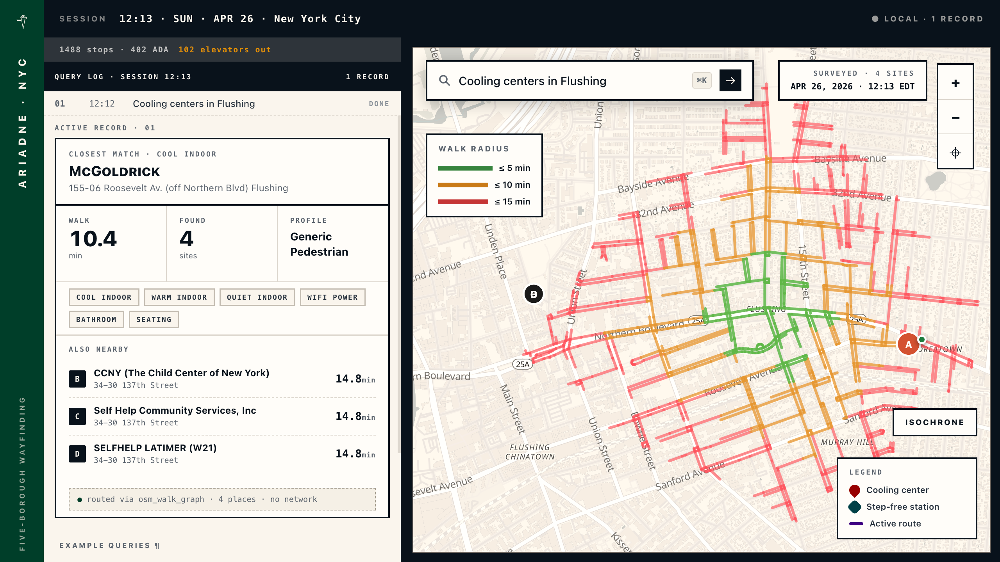
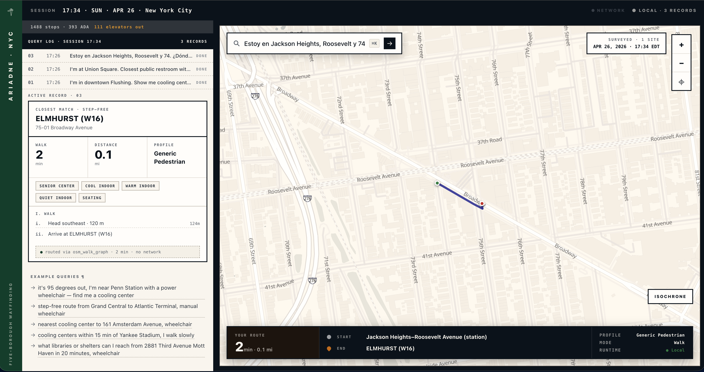

# ariadne-nyc

A browser-based accessibility routing assistant for New York City. Type a question in plain English; get a route or a list of nearby comfort resources back. Everything runs locally. The language model, the routing, the geocoder. Nothing about your query, your route, or your destination leaves the browser.

**Live demo:** https://msradam-ariadne-nyc.static.hf.space (Chrome or Edge with WebGPU; first visit downloads the 1B-parameter model into IndexedDB, ~30 seconds. Subsequent visits are instant).


*Query: "Cooling centers in Flushing." The model picked `find_reachable_resources`, the isochrone shows 5 / 10 / 15-minute walking bands, and the active-record card resolves to McGoldrick (155-06 Roosevelt Av., 10.4 min) with three more sites listed under ALSO NEARBY. Tool pill confirms the dispatch ran locally. `routed via osm_walk_graph · 4 places · no network`.*


*Query: "Estoy en Jackson Heights, Roosevelt y 74. ¿Dónde está el centro de enfriamiento más cercano?" The model parsed the Spanish input, resolved the intersection to Jackson Heights-Roosevelt Avenue station, and routed to ELMHURST (W16). A senior center 2 minutes away. The bottom strip surfaces start, end, profile, and `● local` runtime.*

This repo contains both the app and the data pipeline that produces the graphs and indexes it loads.

## What it does

You type:
- "I'm in downtown Flushing. Show me cooling centers within walking distance, wheelchair-accessible."
- "I'm at Union Square. Closest public restroom with audible signals on the route."
- "Penn Station to Grand Central, wheelchair"
- *"Estoy en Jackson Heights, Roosevelt y 74. ¿Dónde está el centro de enfriamiento más cercano?"*

A 1B-parameter language model runs on your GPU, picks one of three routing tools, fills in the arguments, and the app dispatches it locally:

- **`plan_route`**. Both endpoints named. Returns a walk or walk + subway route.
- **`find_comfort_and_route`**. A need (cool down, rest, charge a phone) plus a place to start. Picks the closest match and routes to it.
- **`find_reachable_resources`**. Same, with a stated time budget. Returns every match in a walking isochrone.

Wheelchair queries get filtered to ADA-accessible subway stations, with stations whose elevators are out today removed from the set (data from the MTA SIRI feed at boot. That's the only network call after the initial assets load).

The model handles English and Spanish input; profile inference is semantic ("audible signals" → low-vision routing weights, no manual selection needed).

## Why the architecture matters

Routing apps usually send your query, location, and destination to a server. We don't. The model is Granite 4.0 1B, served once from HuggingFace, cached in IndexedDB, and run via WebGPU. The walk graph is a 36 MB binary. The transit timetable is 1 MB compiled. The geocoder reads a 23k-entry POI index and (optionally) a 39 MB structured street-address index. Both fully offline.

After the initial asset load, you can disconnect from the network and the app still works. Same answers, same map. The session bar has a `Network / Offline` indicator that flips to green when the OS reports no connectivity. Queries keep producing routes.

Geocoding is fully offline. We previously hit NYC Planning Labs' Pelias for address resolution; that was removed. Address coverage now comes from an OSM Overpass extract built into the repo at build time. The geocoder handles typos (`kwe gardns → Kew Gardens`), abbreviation expansion (`Lex → Lexington Avenue`), and qualifier prefixes (`downtown Flushing → Flushing`).

Geolocation (the browser `navigator.geolocation` API) is feature-gated off in code. On devices without GPS hardware the OS falls back to Wi-Fi positioning, which sends nearby Wi-Fi MAC addresses out of the device. That contradicts the offline guarantee. Until we can gate on a high-accuracy GPS-only fix, we require the user to type their starting point.

## What's in the repo

```
ariadne-nyc/
├── app/                         # SvelteKit + Svelte 5 frontend
├── router/                      # Rust → WASM pedestrian router (Dijkstra over petgraph + rstar)
├── pipeline/                    # Python: build the walk graph + POI/comfort/address indexes
├── scripts/setup-model.sh       # one-shot Granite clone from HuggingFace
├── data/                        # built artifacts (gitignored, regenerable)
├── models/                      # Granite weights (gitignored, fetched by setup-model.sh)
├── ARCHITECTURE.md              # detailed architecture reference
├── METHODOLOGY.md               # pipeline data sources and transformations
└── README.md                    # this file
```

`ARCHITECTURE.md` covers the adapter/service split, the boot sequence, the LLM tool-call protocol, the deployment runbook, and the test infrastructure. Read it before extending the app.

## Running it locally

You'll need:
- Node 20+ and `npm`
- Python 3.11+ and [uv](https://github.com/astral-sh/uv)
- `git-lfs` (for cloning the HuggingFace model repo)
- A GPU that supports WebGPU (Apple Silicon, recent NVIDIA / AMD, Intel Arc). Chrome or Edge.

```bash
git clone https://github.com/msradam/ariadne-nyc
cd ariadne-nyc

# 1. Fetch the language model (~900 MB, one-time)
./scripts/setup-model.sh

# 2. Build the data files (one-time, or whenever sources update)
uv venv && source .venv/bin/activate
uv pip install -e .
uv run python pipeline/sources/fetch_open_data.py --section all
uv run python pipeline/sources/build_address_index.py
# (the OSW walk graph is built separately. See "Pipeline" below)

# 3. Install + run the app
cd app
npm install
npm run dev
```

Open http://localhost:5173. First load takes ~30 seconds while Granite parses into IndexedDB. Subsequent visits are instant.

The app is responsive: it works on a phone (stacked layout, ~55 vh map on top, query log below). Tested on Pixel 9 and iPhone 14 Pro viewports.

## Pipeline

The pipeline produces two kinds of output: the OpenSidewalks-conformant walk graph (the original deliverable; useful on its own for accessibility research) and the indexes the app loads at boot.

### OpenSidewalks v0.3 walk graph

Targets the [OpenSidewalks Schema v0.3](https://sidewalks.washington.edu/opensidewalks/0.3/schema.json) from the Taskar Center for Accessible Technology at the University of Washington. Sidewalks are first-class edges (not attributes of streets). Crossings are edges on road surfaces. Curb interfaces are Point Nodes connecting sidewalks to crossings. Every feature carries `ext:source`, `ext:source_timestamp`, and `ext:pipeline_version`.

Sources, all public:

| Source | What we use it for | License |
|---|---|---|
| OpenStreetMap (via OSMnx + Overpass) | Footways, crossings, steps, residential streets, named POIs, addresses | ODbL-1.0 |
| NYC DOT Pedestrian Ramp Locations (`ufzp-rrqu`) | 217k+ curb ramp points with condition data | Public Domain |
| NYC Planimetric Sidewalks (`vfx9-tbb6`) | Sidewalk polygons from aerial imagery | Public Domain |
| NYC Borough Boundaries (`7t3b-ywvw`) | Borough polygons for region metadata | Public Domain |
| MTA ADA Station List | ADA-accessible subway stations | Public Domain |
| NYC Open Data + NYPL/BPL/QPL APIs | Comfort resources (cooling centers, libraries, restrooms, harm reduction, food pantries, …) | Public Domain / CC BY |

Run:

```bash
python -m pipeline build           # all six stages
python -m pipeline build --stage 3 # resume from stage 3
python -m pipeline validate        # OSW validator only
python -m pipeline clean           # wipe data/ and output/
```

Stages 1-6 produce `output/nyc-osw.geojson` (the canonical OSW output) and a couple of derived formats (GraphML for academic use, a routing-friendly JSON). A separate utility, `pipeline/utils/export_binary.py`, converts the OSW GeoJSON into the compact `nyc-pedestrian.bin` the WASM router consumes.

A full build runs 60-90 minutes and needs ~10 GB free. Set `SOCRATA_APP_TOKEN` if you have one. It raises the NYC Open Data rate limit from 1 req/s to 1000 req/s.

### App-side indexes

These are smaller, faster to rebuild, and live alongside the walk graph in `data/`:

- `nyc-pois.json`. 23k named places from OSM Overpass (libraries, transit, parks, neighborhoods, amenities).
- `nyc-comfort.json`. 6.7k comfort resources from NYC Open Data + library APIs.
- `nyc-streets.json`. ~19k unique street/borough entries holding ~1.4M housenumbers (lazy-loaded; geocoder works without it but loses raw street-address resolution).
- `nyc-addresses.json`. 1.4M raw OSM addr-tagged points (build-only intermediate that `build_address_index.py` consumes).
- `timetable.bin`, `stops.bin`, `ada-stops.json`. Minotor's compiled GTFS for the subway.

```bash
uv run python pipeline/sources/fetch_open_data.py --section pois
uv run python pipeline/sources/fetch_open_data.py --section comfort
uv run python pipeline/sources/fetch_open_data.py --section addresses
uv run python pipeline/sources/build_address_index.py
```

## Tests

The app has a Node CLI harness for fast routing-logic regressions and a Playwright suite for full end-to-end coverage. The Playwright tests drive a real Chromium with WebGPU enabled. They exercise the same code path the user hits, including Granite inference and DOM rendering.

```bash
cd app

# Routing logic, no LLM, ~100 ms per query
npm run route -- plan "Penn Station" "Grand Central" wheelchair
npm run route -- find "Times Square" cool_indoor wheelchair
npm run route -- diagnose "Kew Gardens" "Grand Central" wheelchair   # step-by-step trace
npm run route -- geocode "downtown Flushing"

# Full end-to-end: real Chromium + WebGPU + Granite + WASM
npm run test:e2e

# Quality gate: TypeScript check, dead-code scan, Rust lint, unused-Cargo-deps
npm run quality
```

The diagnostic mode (`npm run route -- diagnose ...`) walks step-by-step through walk-only attempt → nearest stops → ADA filter → RAPTOR loop → walk-in / walk-out feasibility, with each step labeled and colored. It's the fastest way to figure out why a particular trip returns no path.

`tests/e2e/queries-30.spec.ts` runs 30 demo-grade queries through the live model and prints a pass/fail table. `tests/e2e/demo-queries.spec.ts` runs a smaller curated battery used to pick the suggestions that ship in the search bar's dropdown.

## Deploying to HuggingFace Spaces

The app deploys to a static HF Space. The model loads from a separate model repo (`huggingface.co/msradam/Granite-4.0-1b-q4f32_1-MLC`) and is cached in the user's IndexedDB on first visit. The Space serves only the built SvelteKit app and the data files.

`app/DEPLOY.md` has the rsync flow that handles the LFS-tracked binaries correctly. Headline: `npm run build`, rsync `app/build/` into a fresh clone of the Space, restore the LFS-tracked files via `git checkout HEAD --`, push.

## Status

Built for the Code4City hackathon at NYU CUSP, April 2026. The app is functional and demoable; the pipeline is reproducible. There are still rough edges. See "Known Issues" in `ARCHITECTURE.md`.

A couple of things worth knowing:

- **Street-address geocoding works locally, not in the deployed Space yet.** `nyc-streets.json` is 39 MB and HuggingFace Space LFS storage hit its 1 GB free-tier quota on this repo from earlier deploys. Until the LFS pool is reclaimed, the live demo resolves named places (23k POIs covering landmarks, transit, parks, neighborhoods) but not raw addresses like "123 Main St, Brooklyn". `npm run dev` locally has the full geocoder.
- **Intersection geocoding ("125th and Lex", "42nd & 8th") is not yet implemented.** Build-time precompute is sketched in `ARCHITECTURE.md`; ~30-45 minutes of work.
- **Geolocation is feature-gated off** for the privacy reason described above. The UI prompts for an explicit starting point when the user doesn't give one.

## License

Apache-2.0. See [LICENSE](LICENSE).

Built on public data from OpenStreetMap (ODbL), NYC Open Data (Public Domain), MTA (Public Domain), NYPL (CC BY 2.0), and the OpenSidewalks Schema (open spec).

The Granite 4.0 1B language model is from IBM, distributed under Apache 2.0. The WASM router is original code in this repo. Minotor (the RAPTOR transit router) is its own npm package.
